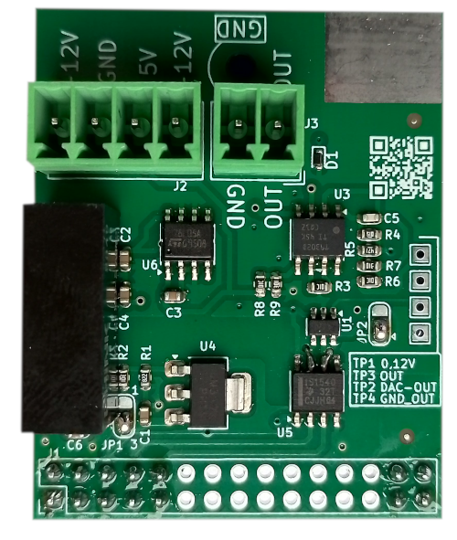

# Out_0_10V

This Arduino library is designed for easy operation of the <a href="https://github.com/krzychoooo/Mercury_PCB_UOut1-10V_V100" target="_blank">Mercury_PCB_UOut1-10V_V100</a> .

<picture></picture>

This library requires the use of the library <a href="https://github.com/RobTillaart/MCP4725.git" target="_blank">https://github.com/RobTillaart/MCP4725.git</a>

## How to use:   
Run example 1.   
* This Arduino library is designed for easy operation of the Mercury OUT10V module.
This library requires the use of the library.

How to use

Run example 1   
* Connect the serial port to the monitor (9600).   
* Connect a voltmeter to the output.   
* In the terminal, use the "+" and "-" keys to ensure the voltmeter reads as close to 0V as possible.   
* Rewrite the value from the terminal to the constant NUMBER0V.   
* In the terminal, use the "+" and "-" keys to get the voltmeter reading as close to 10V as possible.   
* Rewrite the value from the terminal to the constant NUMBER10V.   

Recompile and upload the program.   

This action will calibrate the module.   
Now, after pressing the "u" key, you can enter the number of millivolts.   
For example, to set 7.5V, enter:   
u7500.   

